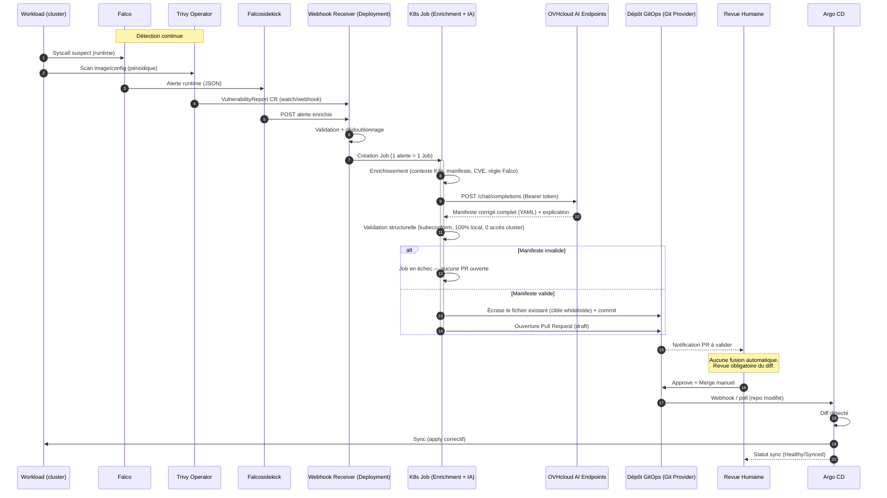

# Architecture — Boucle de Remédiation GitOps Sécurisée

## Invariants de sécurité

- Le `Job` d'enrichissement IA n'a **aucun droit d'écriture** sur le cluster (RBAC `get`/`list` seulement).
- Le token GitHub/GitLab utilisé par le `Job` n'a **jamais** le droit de merge (scope `pull_request:write` seulement, pas `contents:write` sur la branche protégée).
- Seul Argo CD (déjà autorisé, GitOps) applique les changements sur le cluster, et seulement après merge humain.
- Toute policy Kyverno générée par l'IA est livrée en mode proposé dans la PR — jamais appliquée en `Enforce` sans revue.
